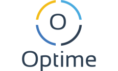

[![MIT License][license-shield]][license-url]
[![LinkedIn][linkedin-shield]][linkedin-url]
[![Website][website-shield]][website-url]


<!-- PROJECT LOGO -->
<br />
<p align="center">
 
 <a href="https://github.com/matiszz/Optime">
    
  </a>

  <h3 align="center">Optime</h3>

  <p align="center">
    The definitive time and tasks organizer
  </p>
  <p align="center">
    <a href="https://optime-5785c.web.app/signin"><strong>Try the demo!</strong></a>
  </p>
</p>


<!-- About the project -->
## 😎 About

[![Product Name Screen Shot][product-screenshot]](https://github.com/matiszz/Optime)

This project was made in **36h** for the HackUPC hackathon.

It is an excelent time organizer. It permits to create new tasks and assing the time that you're planning to spend on it. Is like a Trello but just made it simple.

Feel free to try the [demo](https://optime-5785c.web.app/signin)! It's all hosted in Firebase.


<!-- GETTING STARTED -->
## 👉🏽 Getting Started

### Prerequisites
Make sure to install:

- [npm](https://www.npmjs.com/)

### Installation

1. Clone the repo
```sh
git clone https://github.com/Optime.git
cd Optime/
```
2. Install NPM packages
```sh
npm install
```
3. Run
```sh
npm start
```


<!-- LICENSE -->
## 📚 License

Distributed under the MIT License. See `LICENSE` for more information.


<!-- CONTACT -->
## 📞 Contact

Matias Szarfer - 🐤 [@matiasszarfer](https://twitter.com/matiasszarfer) · 📧 matias@szarfer.com · 💻 [matias.szarfer.com](https://matias.szarfer.com)

Project Link: [https://github.com/matiszz/Optime](https://github.com/matiszz/Optime)


<!-- MARKDOWN LINKS & IMAGES -->
<!-- https://www.markdownguide.org/basic-syntax/#reference-style-links -->
[contributors-shield]: https://img.shields.io/github/contributors/matiszz/Optime.svg?style=flat-square
[contributors-url]: https://github.com/matiszz/Optime/graphs/contributors

[license-shield]: https://img.shields.io/github/license/matiszz/Optime.svg?style=flat-square
[license-url]: https://github.com/matiszz/Optime/blob/master/LICENSE.txt

[linkedin-shield]: https://img.shields.io/badge/-LinkedIn-black.svg?style=flat-square&logo=linkedin&colorB=555
[linkedin-url]: https://linkedin.com/in/matias-szarfer

[website-shield]: https://img.shields.io/badge/-Website-black.svg?style=flat-square&colorB=555
[website-url]: https://matias.szarfer.com

[product-screenshot]: images/screenshot.png